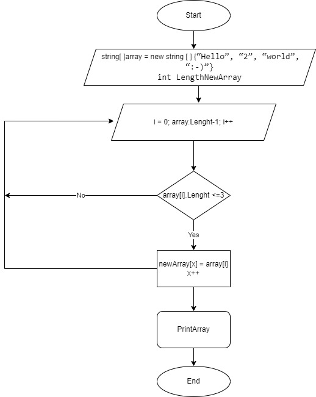

# Задание
Задача алгоритмически не самая сложная, однако для полноценного 
выполнения проверочной работы необходимо:

1. Создать репозиторий на GitHub
2. Нарисовать блок-схему алгоритма (можно обойтись блок-схемой основной 
содержательной части, если вы выделяете её в отдельный метод)
3. Снабдить репозиторий оформленным текстовым описанием решения (файл README.md)
4. Написать программу, решающую поставленную задачу
5. Использовать контроль версий в работе над этим небольшим проектом 
(не должно быть так, что всё залито одним коммитом, как минимум этапы 2, 3, и 4 
должны быть расположены в разных коммитах)
**Задача:**
Написать программу, которая из имеющегося массива строк формирует новый массив из строк, 
длина которых меньше, либо равна 3 символам. Первоначальный массив можно ввести с 
клавиатуры, либо задать на старте выполнения алгоритма. При решении не рекомендуется 
пользоваться коллекциями, лучше обойтись исключительно массивами.

*Примеры:*
[“Hello”, “2”, “world”, “:-)”] → [“2”, “:-)”]
[“1234”, “1567”, “-2”, “computer science”] → [“-2”]
[“Russia”, “Denmark”, “Kazan”] → []

**Создание кода**
// Написать программу, решающую поставленную задачу
string[] array = new string[] {};

string Userenter = ReadInput("Input the command: ");
switch (Userenter)
{
    case "1":
        array = new string[] { "Hello", "2", "world", ":-)" };
        break;
    case "2":
        array = new string[] { "1234", "1567", "-2", "computer science" };
        break;
    case "3":
        array = new string[] { "Russia", "Denmark", "Kazan" };
        break;
    default:
        Console.WriteLine($"{Userenter} - Wrong command");
        break;
}

int LengthNewArray  = 0;
for (int i = 0; i <= array.Length - 1; i++)
{
    if (array[i].Length <= 3) LengthNewArray
    ++;
}

string[] newArray = new string[LengthNewArray];
int x = 0;

for (int i = 0; i <= array.Length - 1; i++)
{
    if (array[i].Length <= 3)
    {
        newArray[x] = array[i];
        x++;
    }
}

PrintArray(array);
Console.Write("→ ");
PrintArray(newArray);

// Функция: Вывод команд для работы с программой
void Commands()
{
    Console.WriteLine();
    Console.WriteLine("СПИСОК КОМАНД:");
    Console.WriteLine("1 – использовать массив: [“Hello”, “2”, “world”, “:-)”]");
    Console.WriteLine("2 – использовать массив: [“1234”, “1567”, “-2”, “computer science”]");
    Console.WriteLine("3 – использовать массив: [“Russia”, “Denmark”, “Kazan”]");
    Console.WriteLine();
}

// Функция ввода
string ReadInput(string msg)
{
    Console.Write(msg);
    return Console.ReadLine();
}

//  Функция вывода массива в терминал
void PrintArray(string[] array)
{
    Console.Write("[ ");
    for (int i = 0; i < array.Length; i++)
    {
        Console.Write($"“{array[i]}”, ");
    }
    Console.Write("] ");
}

**Вывод на Console:**
*Пример 1*
PS C:\Users\genya\Dropbox\My PC (DESKTOP-SBO8KNE)\Desktop\final task work\code> dotnet run
Input the command: 1
[ "Hello", "2", "world", ":-)", ] → [ "2", ":-)", ] 
PS C:\Users\genya\Dropbox\My PC (DESKTOP-SBO8KNE)\Desktop\final task work\code> 
*Пример 2*
Input the command: 2
[ "1234", "1567", "-2", "computer science", ] → [ "-2", ] 
PS C:\Users\genya\Dropbox\My PC (DESKTOP-SBO8KNE)\Desktop\final task work\code>
*Пример 3*
Input the command: 3
[ "Russia", "Denmark", "Kazan", ] → [ ] 
PS C:\Users\genya\Dropbox\My PC (DESKTOP-SBO8KNE)\Desktop\final task work\code>

**Блок схема**

